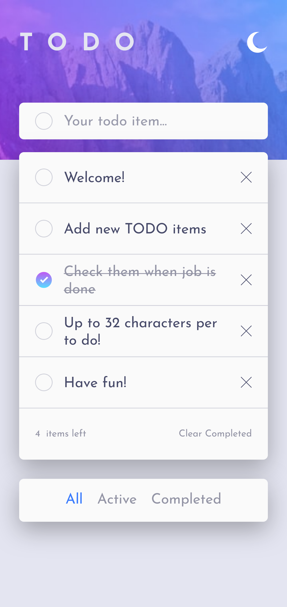

# Frontend Mentor - Todo app - React solution

This is a solution to the [Todo app challenge on Frontend Mentor](https://www.frontendmentor.io/challenges/todo-app-Su1_KokOW). Frontend Mentor challenges help you improve your coding skills by building realistic projects.

## Table of contents

- [Overview](#overview)
  - [Screenshot](#screenshot)
  - [Links](#links)

## Overview

**Note**: This solution does not aim to create interactivity / usability of the app, it's just a design implementation. For the interactive solution please check my todo-app-react solution [here](https://github.com/mihai2537/todo-app-react).

### Screenshot

### Links

- Solution URL: [github](https://github.com/mihai2537/todo-app-react)
- Live Site URL: [live site](https://mihai2537.github.io/todo-app-react/)
